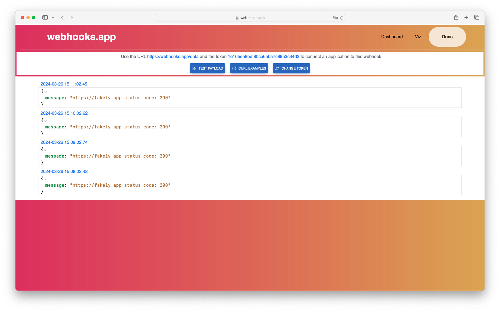

This example shows how to use GPTScript to run regular tasks. It involves the creation of a VM and defines a crontab entry onto that one.  

This example checks if a specific URL is reachable and sends the status code to an external webhook. If you want to test this example, you need to follow the steps below:

- Create a DigitalOcean PAT token and export it in the DIGITALOCEAN_ACCESS_TOKEN environment variable

- Create a new ssh key on your local machin

```
ssh-keygen -f /tmp/do_gptscript
```

- Define a new ssh key in DigitalOcean using the public part of the ssh key created above and call it *gptscript*

- Get a token from [https://webhooks.app](https://webhooks.app)


Note: your token will be different

- Run gptscript example using this token

```
gptscript --cache=false ./regular-task.gpt --url https://fakely.app --token 1e105ea8bef80ca6aba7c8953c34d3
```

- Check the message coming every minute on the [Webhooks dashboard](https://webhooks.app/dashboard)



- Once you'r done do not forget to remove the DigitalOcean VM created in the process